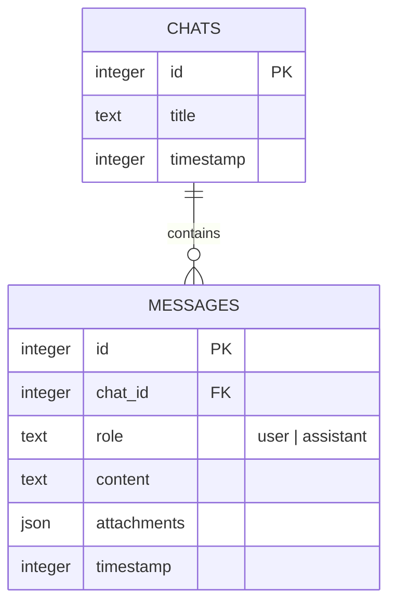

# Architecture Specification

## System Overview

The **Multi-Modal AI Agent Web App** is a real-time, persistent chat application that leverages Google's Gemini 1.5 Flash model for multi-modal interaction (Text, Image, File processing).

The application is structured as a Monorepo using **NPM Workspaces**, consisting of a React-based Client and an Express-based Server.

## Technology Stack

### Frontend (Client)
- **Framework**: Vite + React 19 + TypeScript
- **Styling**: Tailwind CSS v4 + Framer Motion (Animations)
- **State Management**: Zustand (Chat storage, streaming state, App modes)
- **Modes**:
  - **Chat**: Standard LLM interaction.
  - **TTS**: Audio generation studio.
  - **Image Studio**: Image generation and editing.
  - **Video Studio**: Video generation.

### Backend (Server & Microservices)
The backend uses a **Polyglot Microservices** architecture:

1.  **Core API (Node.js)**:
    -   Port: `5000`
    -   Responsibilities: Orchestration, Chat Persistence (SQLite), File Uploads, Gemini Integration.
    -   Stack: Express, Drizzle ORM, Better-SQLite3.

2.  **AI Microservices (Python/FastAPI)**:
    -   **Audio Service**: Qwen3-TTS / Voice Cloning.
    -   **Image Service**: Qwen-Image Generation & Editing.
    -   **Video Service**: LTX-2 Video Generation (Port `8002`).

### Infrastructure
- **Monorepo**: Managed via npm workspaces (`client`, `server`) and independent Python service directories.
- **Storage**: Local filesystem for uploads (`/uploads`).
- **Communication**: REST APIs (Client communicates directly with Microservices for heavy generation tasks to avoid blocking the core server).

---

## Data Model

The database is managed via **Drizzle ORM** with a SQLite backend.

### ER Diagram

### Schema Details
- **Chats**: represents a single conversation session.
- **Messages**: represents individual exchanges. Attachments are stored as JSON blobs containing `{ name, url, type }`.

---

## Key Modules

### 1. Chat Streaming Pipeline
The application uses Server-Sent Events (SSE) to stream AI responses token-by-token.

**Flow:**
1. Client POSTs message to `/api/chat`.
2. Server saves User message to DB.
3. Server retrieves last 20 messages for context window.
4. Server invokes `gemini-1.5-flash` with streaming enabled.
5. Server writes SSE chunks (`data: {"token": "..."}`) to response.
6. Server accumulates full text and saves Assistant message to DB on completion.
7. Server sends `[DONE]` event.

### 2. File Uploads
- **Handler**: `server/routes/upload.ts` uses `multer`.
- **Storage**: Files are saved to `server/uploads`.
- **AI Processing**: File paths are resolved and converted to Base64 to be sent inline to Gemini (Multi-modal inputs).

### 3. State Management (`useChatStore`)
- **`activeChatId`**: Tracks the current session.
- **`messages`**: Array of current session messages.
- **`chats`**: List of all historical sessions.
- **`loadChats()`**: Fetches history for sidebar.
- **`selectChat(id)`**: Switches context and loads message history.

## Development Workflow
- **Validation**: Schema is shared between client and server via `@shared/schema.ts` to ensure type safety across the network boundary.
- **Migrations**: `drizzle-kit` manages SQLite schema updates.
