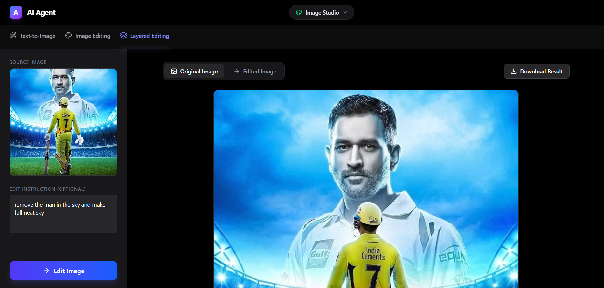
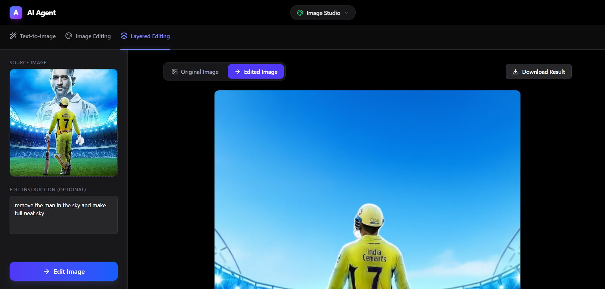

Working on vm instance = gpu_1x_a100_sxm4

-----------------------------------------------------------------------

image editing using layered way 

prompt: remove the man in the sky and make full neat sky

original image:
        

edited image:
        

Time taken to edit image: 10-15 minutes approx

-----------------------------------------------------------------------

VRAM (GPU Memory)

🔹 Currently Used:

1.8 GB (approx 1805 MiB)

---------------------------------------------------------------------------

Normal Ram Usage:

🔹 Currently Used:

Only 5.8 GB

---------------------------------------------------------------------------

Cpu status:

%Cpu(s): 3.5 us, 0.9 sy, 95.6 id

Meaning:
 95.6% idle
 Only ~4.4% being used

--------------------------------------------------------------------------- 

Gpu Usage:

GPU-Util: 62%

It is actively computing

-----------------------------------------------------------------------------

Working Process:

1. **Dynamic Layer Splitting:** 
   When an image is uploaded, the backend evaluates its complexity using Laplacian edge detection (`ImageFilter.FIND_EDGES`). Based on the image's "edge variance" score, it dynamically splits the image into 2 to 6 layers. Simple images get 2 layers, while highly complex ones get up to 6. This avoids unnecessary computation compared to a hardcoded 4-layer split.

2. **Semantic Auto-Targeting via CLIP:**
   The user's text prompt (e.g., "Add glowing magic effects") and all the generated layer images are fed into OpenAI's `clip-vit-base-patch32` Vision-Language Model. CLIP calculates similarity scores between the text prompt and each layer.

3. **Target Layer Selection:**
   The backend automatically identifies the layer with the highest CLIP probability score, representing the semantic match for the prompt. This eliminates the need for manual layer selection by the user.

4. **Image Editing:**
   The selected target layer is processed by the `QwenImageEditPipeline` using the user's prompt. 

5. **Layer Recomposition:**
   Once edited, the layer's original alpha channel is restored, and all layers are recomposited sequentially from back to front, returning the final cohesive image.

6. **Memory Management (VRAM limitations):**
   Because the Qwen Layered and Edit models are massive, the server utilizes `enable_sequential_cpu_offload()` to keep VRAM usage strictly within the 40GB limits of an Nvidia A100 GPU. It safely swaps neural network blocks in and out of GPU memory. Additionally, aggressive garbage collection (`gc.collect()` and `torch.cuda.empty_cache()`) occurs between the pipeline executions to completely prevent PyTorch CUDA Out Of Memory errors.
   
-----------------------------------------------------------------------------
